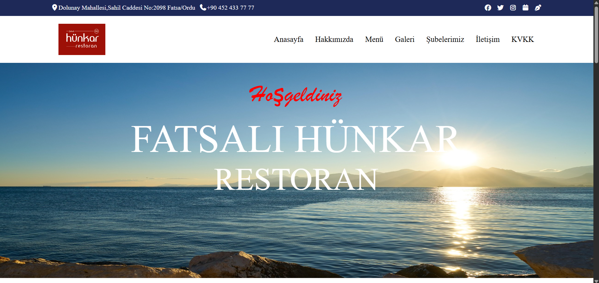
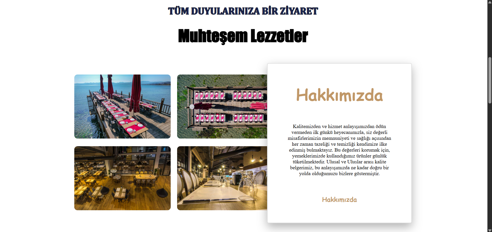
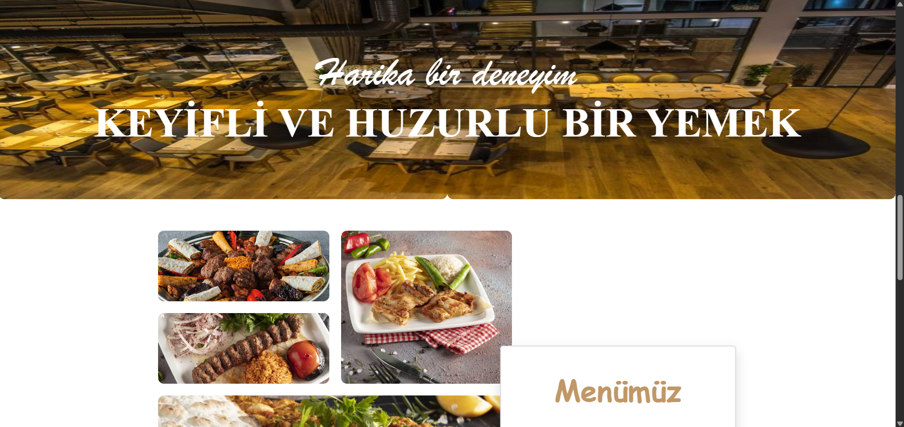
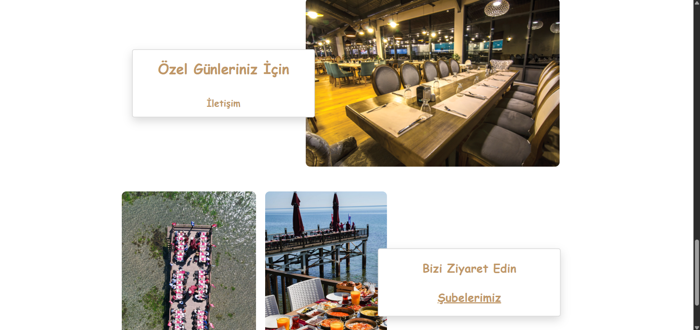

# 🍽️ **Hünkar Restaurant Website** 🏛️

**Responsive Hünkar Restaurant Website – A Personal Coding Project** ✨

---

## 🚀 **Overview**
I recreated the Hünkar Restaurant website as a **fun and educational project**. I truly enjoy visiting Hünkar Restaurant, so I decided to **code their website myself** to practice modern web design techniques.  

The project showcases a **clean and responsive layout** using **HTML5** and **CSS3**, with features like **CSS Grid**, **Flexbox**, **z-index**, and **positioning** to create precise and visually appealing sections. The website adapts perfectly to both desktop and mobile screens.

---

## 🛠️ **Tech Stack**
- **HTML5** 🌐  
- **CSS3** 🎨  

---

## 📑 **Key Highlights**
- 📱 **Fully Responsive:** Optimized for multiple screen sizes, from mobile to desktop.  
- ✨ **Modern Layout:** Clean design leveraging CSS Grid and Flexbox.  
- 🖼️ **Design Details:** Strategic use of `position`, `z-index`, and layout techniques for a polished look.  
- 💻 **Learning Focus:** A practical way to enhance coding skills in HTML, CSS, and responsive design.  

---

## 🎥 **Preview**
  




---

## 🌐 **Live Demo**
The website is hosted on GitHub Pages: [View Live Site](https://beratkrbltt.github.io/Hunkar_Restaurant/)  

---

## 🛠️ **How to Run Locally**
Clone the repository and open `index.html` in your browser:

```bash
git clone https://github.com/beratkrbltt/hunkar-project.git
